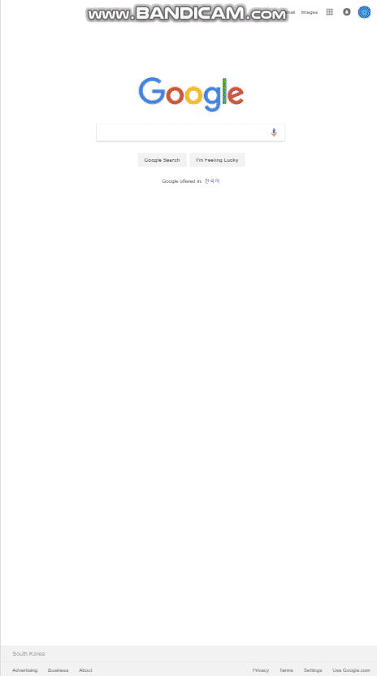
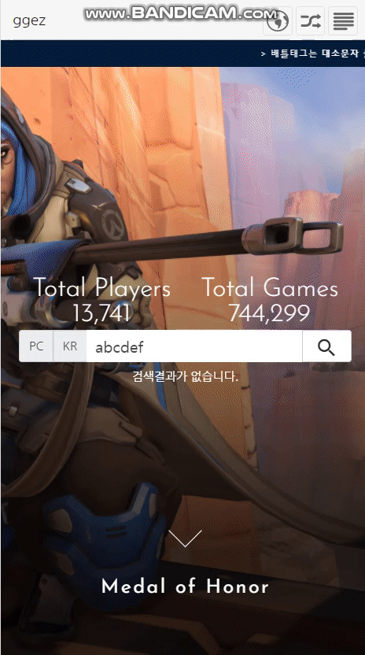
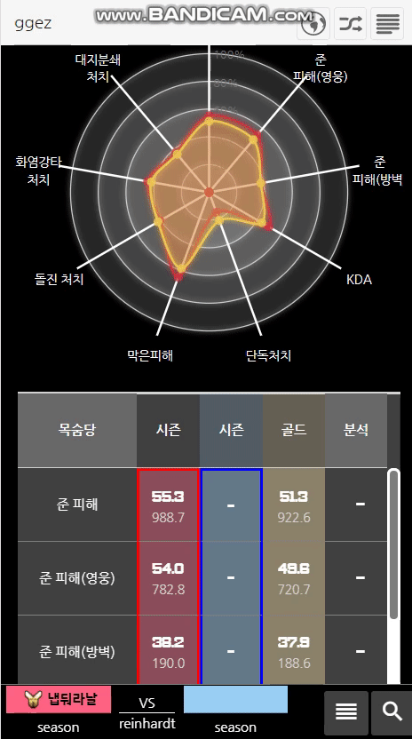
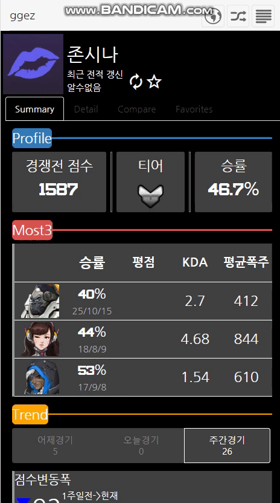

# Now beta service is available
* [http://ggez.kr](http://ggez.kr)

# Tech Stack

    
    
    

    
    
    
    

# Snapshot and Screenshot
<table>
    <tbody>
        <tr>
            <td> </td>
            <td> </td>
            <td> </td>
        </tr>
        <tr>
            <td align="center"> index </td>
            <td align="center"> overview </td>
            <td align="center"> detail </td>
        </tr>
    </tbody>
<table>
<table>
    <tbody>
        <tr>
            <td> </td>
            <td> </td>
        </tr>
        <tr>
            <td align="center"> compare </td>
            <td align="center"> favorite </td>
        </tr>
    </tbody>
<table>

# Technical Report
* 한국어로 된 기술문서를 보시려면 [여기로](./README_kr.md)
* Technical document in english link is [here](./README_en.md)

# as-was vs as-is
<table style="text-align:center">
    <tr>
        <th colspan="2">구분</th>
        <th>as-was(ggez)</th>
        <th>as-is(new-ggez)</th>
        <th>to-be</th>
        <th>detail</th>
    <tr>
    <tr>
        <td rowspan="6">개발</td>
        <td>기간</td>
        <td>3달</td>
        <td>5달</td>
        <td></td>
        <td></td>
    </tr>
    <tr>
        <td>언어</td>
        <td>php, javascript, html, css</td>
        <td>javascript, html, css</td>
        <td>-</td>
        <td>Link</td>
    </tr>
    <tr>
        <td>프레임워크</td>
        <td>-</td>
        <td>nodejs, express, angularjs</td>
        <td>-</td>
        <td>-</td>
    </tr>
    <tr>
        <td>데이터베이스</td>
        <td>mysql</td>
        <td>mongodb</td>
        <td>-</td>
        <td>-</td>
    </tr>
    <tr>
        <td>부가기술</td>
        <td>jquery</td>
        <td>jquery, webpack</td>
        <td>-</td>
        <td>-</td>
    </tr>
    <tr>
        <td>태스크러너</td>
        <td></td>
        <td>gulp</td>
        <td>-</td>
        <td>-</td>
    </tr>
    <tr>
        <td>크롤링시간</td>
        <td>약 5시간 / 13,000</td>
        <td>약 2시간 30분 / 13,000</td>
        <td>-</td>
        <td>-</td>
    </tr>
    <tr>
        <td rowspan="3">운영</td>
        <td>데일리 레포트</td>
        <td>수동 (매일 조회)</td>
        <td>자동 (매일 이메일)</td>
        <td>-</td>
        <td>-</td>
    </tr>
    <tr>
        <td>빌드</td>
        <td>-</td>
        <td>gulp and webpack (vendor and bundle)</td>
        <td>-</td>
        <td>-</td>
    </tr>
    <tr>
        <td>배포</td>
        <td>수동 (파일질라)</td>
        <td>자동 (ssh, gulp, linux)</td>
        <td>-</td>
        <td>-</td>
    </tr>
    <tr>
        <td rowspan="2">테스트</td>
        <td>서버</td>
        <td>-</td>
        <td>-</td>
        <td>mocha, chai</td>
        <td>-</td>
    </tr>
    <tr>
        <td>클라이언트</td>
        <td>-</td>
        <td>-</td>
        <td>karma, protractor</td>
        <td>-</td>
    </tr>
</table>

# Reamining Job
## Ux, Ui
* radarchart legend
* ~~detail and compare page selectors hidden.(not toggling)~~
* ~~table th align text~~
* need to add hero moira
* index page table and anchor collision
* ~~in search bar loading bar bigger.~~
* ~~recent update time~~
* ~~table result strong and weaker span~~

## Bug-fix
* ~~hero torbjorn, bastion bug~~
* compare table score appear minus value
* webpack vendor hash value check(status ok but not cache use in browser)
* hero.detail.component can not get diff season data...
* random page random number must be based on cahce factory
## Post Service
* Test and Refactoring
* i18n
* Ranking
    * main page ranking
    * hero page ranking

* build client 아직 완성되지 않음 inject:css라던지...
* revReplaceWebpack
* api dummy test

* webpack uglyfy in production mode.
* image compress
* webpack revision for deploy... version update.. bundle and vendor.js
* inject css
* gulp-git으로 버전관리?

# Roadmap
## Technical
* Check Mongoose Schema how many memories uses.
    * Sometimes. register mulitple collection one schema...
* Reverse Engineering for how to way to design in plan and code
* Make rich component(`onloading` `onResultTrue` `onResultFalse`)
* drop old collections
* go last view(or mine) icon based on server session
* failed craw players when on cron job, set deprecated true.
* tier-data.json neede minify.
### Client
* App
  * Apply Ajax Live Search at Friend search
    * [Ref1](https://www.sitepoint.com/14-jquery-live-search-plugins/)
    * [Ref2](https://www.npmjs.com/package/hideseek)
* Util
  * ng-enter needs auto-erasable and not working when blank field attribute

## Features
* 랭킹테이블 만들기
* 라이브서치
* 공유하기
* 로그인해서 즐겨찾기
# Release Note
